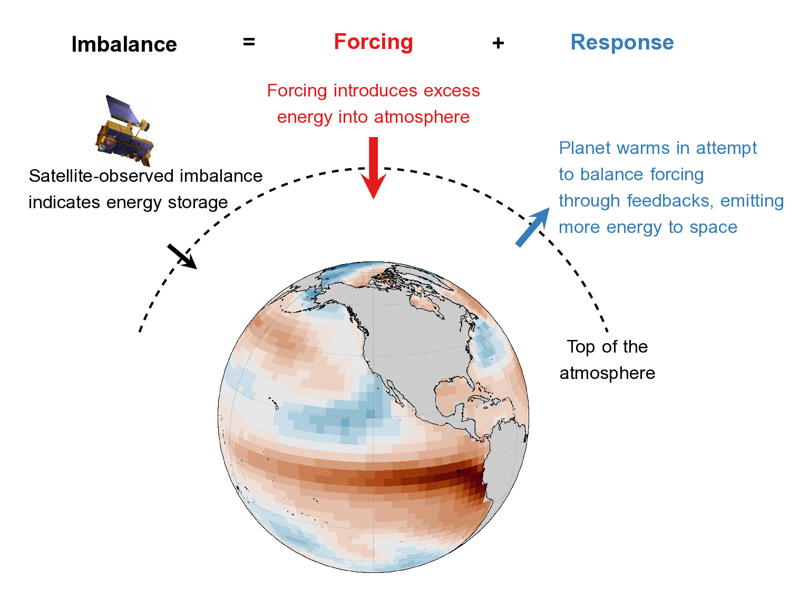
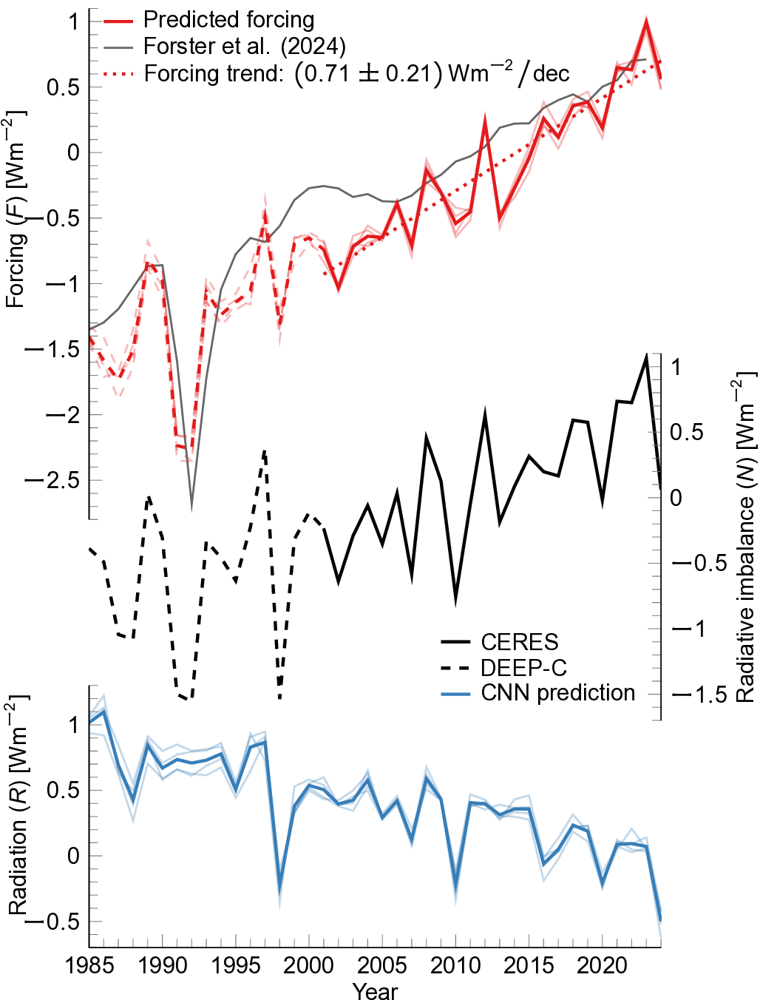
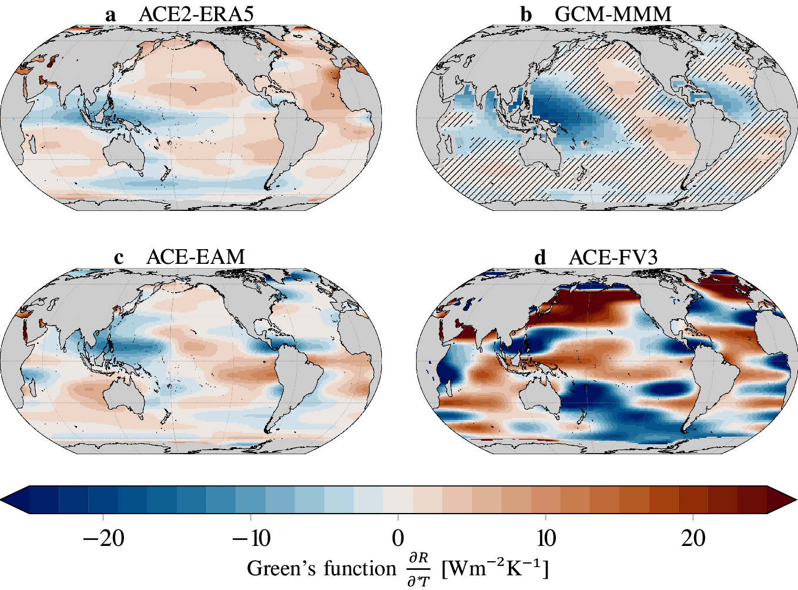
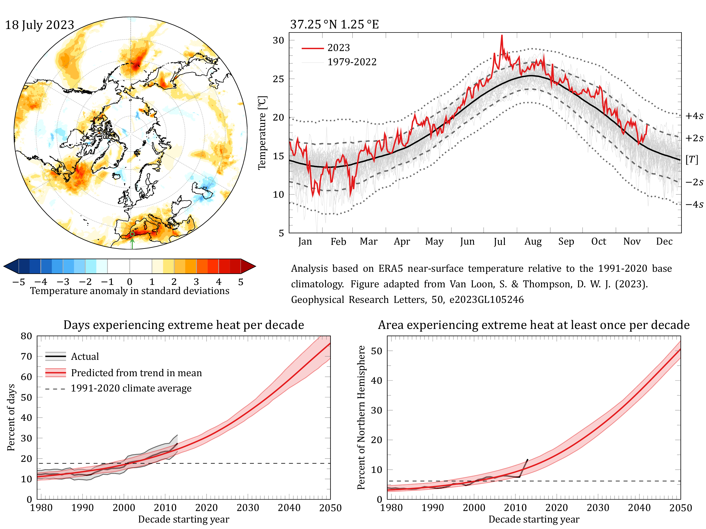
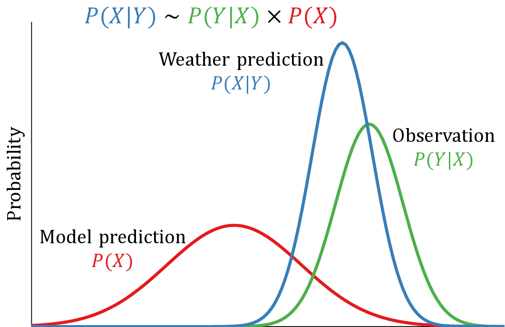

## Bridging Climate Models and Observations

{: style="text-align: justify" }
Climate models are an indispensable tool to learn more about the Earth system, but they often fail to reproduce observations. Machine learning (ML) offers an excellent framework for recognizing (nonlinear) patterns in data that might otherwise be overlooked, which can be used to learn more about model biases. By using techniques such as explainable artificial intelligence (XAI) and transfer learning, we can better understand historical climate change.

    
    
<em>Earth's energy budget</em>

{: style="text-align: justify" }
My work has focused on using ML to bridge this gap, with the main goal to better understand of the energy flow at the top of the atmosphere, a key metric of climate change. Human-induced emissions have created an *imbalance* in the Earth's radiation budget, leading to planetary warming. Climate models fail to simulate the observed imbalance, and the exact underlying drivers are still unknown. In the simplest energy balance model, the difference between the incoming and outgoing energy at the top of the atmosphere (the *energy (im)balance*) is split up into a *forcing* term and a *response* term. The *forcing* quantifies the effect of human-induced (such as CO2 emissions) and natural perturbations (such as volcanic eruptions) to this energy balance. The Earth *responds* to this forcing through different feedback processes. By warming the planet, more energy gets emitted to space, in an attempt to balance the introduced forcing.

    
    
<em>Estimating Effective Radiative Forcing</em>

### Observation-based Estimate of Effective Radiative Forcing

{: style="text-align: justify" }
Effective radiative forcing is the radiative perturbation of the atmosphere before surface temperature changes. Quantifying this effect is key to understanding Earth's energy balance, testing climate theories, building climate models, and attributing climate change. Effective forcing cannot be observed and its calculation relies on climate models, which come with biases and assumptions of the radiative effect of emissions and cloud processes that are not understood well yet. In [our work](https://doi.org/10.1073/pnas.2425445122), we develop a new framework to calculate historical forcing that makes minimal use of climate models, by combining artificial intelligence with direct observations. Our forcing estimate indicates a strong upwards trend in the last two decades, can be updated immediately with new observations, and increases our understanding of Earth's recent energy imbalance. Effective radiative forcing has substantially increased since 2021 and has not been countered by a strongly negative radiative response until 2024, consistent with exceptional warmth in 2023 and 2024.

## Machine Learning-based Earth System Modeling

{: style="text-align: justify" }
Recent advances in machine learning have made it possible to emulate the physical processes in the atmosphere in a computationally efficient way. These emulators replace parts or the entirety of traditional climate models with deep learning methods by extracting the relevant physical relationships from observational products or other climate models. Because they can be trained on reanalyses (a dataset that combines model predictions with observations to create a coherent picture of the historical weather and climate), machine learning-based climate emulators offer a new way of probing the "observed" climate system.

### Distilling Climate Emulators

    
    
<em>
        Green's functions of the Ai2 Climate Emulator
    </em>

{: style="text-align: justify" }
The progress made over the last few years has been significant and machine learning is showing great promise to address many open problems in climate science. Yet, these machine learning-based emulators have to be evaluated before they can be trusted to answer actual scientific questions similar to traditional Earth system models.

{: style="text-align: justify" }
[We propose](https://doi.org/10.48550/arXiv.2502.10893) Green's function simulations – idealized experiments that linearize the causal response to localized surface temperature perturbations – as a "distillation model" of climate emulators. The linear Green’s functions allow us to physically interpret and evaluate the nonlinear statistical climate emulator and understand whether it provides answers for the correct physical reasons.

## Extreme Weather & Climate Events

{: style="text-align: justify" }
Extreme events, such as heat waves or droughts, occur sporadically but have significant societal impacts. In a warming climate, these extremes are expected to become more frequent and severe, raising questions about their future behavior and impact. For example, in July 2023, a heat wave over the Mediterranean caused daily temperatures to be 12°C above average in certain locations. Simultaneously, large areas in the world experienced higher than normal temperatures. (See figure for a map of temperature anomalies and temperature at a location in the Mediterranean in 2023 compared to the climatological average.)

    
    
<em>
        Local versus hemispheric perspective of heat waves
    </em>

{: style="text-align: justify" }
In [our work](https://doi.org/10.1029/2023GL105246), we contrast the local and hemispheric perspective of heat waves, and confirm that global warming is the main driver of the increase in occurrence of extreme heat. Locally, similar heat waves are only expected less than once per century. From a hemispheric perspective, similar events occurred on average every ten days somewhere in the Northern Hemisphere in the last thirty years. As our planet warms, the frequency of heat waves is only increasing; in the last decade, a quarter of all days saw extreme heat somewhere in the Northern Hemisphere (black lines in bottom panels show the observed percent of days in a decade (left) and area of the Northern Hemisphere (right) that experienced extreme heat similar to the 2023 Mediterranean heat wave).

{: style="text-align: justify" }
If warming continues at the same rate, we expect that 75% of all days will see extreme heat events by 2050. Half of the Northern Hemisphere will experience a heat wave at least once in the decade 2050-2059 (red lines show predictions of heat wave occurrence if warming continues linearly over the next few decades).

## Data Assimilation

{: style="text-align: justify" }
The Earth system is chaotic. In theory, the flap of a butterfly’s wings could set off a tornado on the other side of the world, but could just as easily stop a tornado from forming. This makes it difficult to make predictions, and yet we are able to make decent weather forecasts, at least on the timescale of a couple of days. All of this is possible due to a meticulous combination of physical model predictions and observations, a technique called [data assimilation](https://seasonedchaos.github.io/Mastering-Chaos-A-Spooky-Introduction-to-Data-Assimilation/).

    
    
<em>
        Bayes' theorem for weather prediction
    </em>

Data assimilation is the mathematics that was developed for numerical weather prediction, although it can more broadly be applied to any situation where you want to predict the future of a chaotic system (for example, [finding the best trick-or-treating route](https://seasonedchaos.github.io/Mastering-Chaos-A-Spooky-Introduction-to-Data-Assimilation/)). It relies on Bayes' theorem, a formula for calculating conditional probabilities when new information comes along. In essence, data assimilation combines all of the information provided (observations and model predictions), to suggest a best bet of the current state.

In many applications of data assimilation, especially when the size of the problem is large, a substantial assumption is made: all variables are well-described by Gaussian error statistics. This assumption has the advantage of making calculations considerably simpler, but it is often not valid, leading to biases in forecasts or, even worse, unphysical predictions. My work has focused on *nongaussian* data assimilation, that relaxes the Gaussian assumption For example, [we introduced](https://doi.org/10.1029/2023GL105148) a general framework that that allows for a much broader scope of statistics. This generalization can significantly improve prevailing methods.

## Cold Atom Physics

{: style="text-align: justify" }
My scientific career began as a quantum physicist, in particular working on the theory of *ultracold atomic gases*. These are systems where a gas is cooled down to almost absolute zero (the lowest possible temperature, where all particles stand still). They offer a versatile system with which quantum mechanics can be studied on a macroscopic scale. Specifically, it allows to study *superfluidity* in different regimes. Superfluidity, a state where a fluid has no viscosity and thus there is flow without resistance, is closely related to *superconductivity*, electrical flow without resistivity. A technical review of some of the questions I was thinking about was published in [Annual Reviews](https://doi.org/10.1146/annurev-conmatphys-032922-115341).
